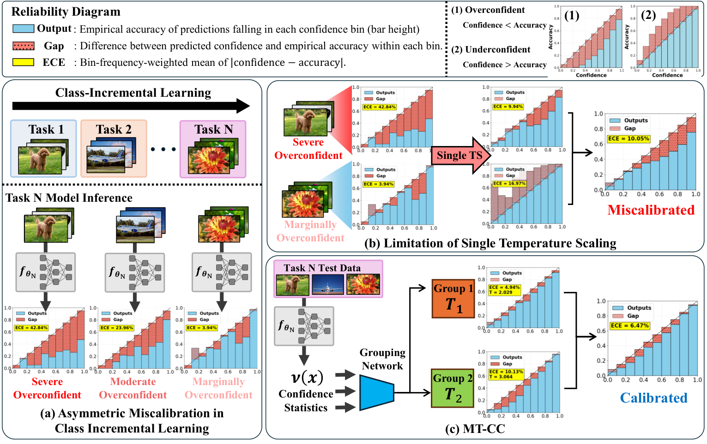

# MT-CC: Multi-Group Temperature Scaling for Asymmetric Calibration Behavior in Class-Incremental Learning

Official code release of "MT-CC: Multi-Group Temperature Scaling for Asymmetric Calibration Behavior in Class-Incremental Learning." (NeurIPS 2026 Spotlight)

MT-CC is a post-hoc calibration framework for class-incremental learning (CIL) that addresses asymmetric calibration behavior, where confidence and accuracy evolve at different rates across tasks. Instead of relying on a single global temperature, MT-CC learns multiple group-specific temperatures using a lightweight grouping network conditioned on CIL-aware confidence statistics. A Groupwise Difference-between-Confidence-and-Accuracy (GDCA) objective further promotes calibration consistency within each group.




## 🔍 Method Overview

MT-CC performs calibration after each incremental task.

For an input sample $x$, the grouping network uses the calibration feature

$$
v(x) = [\delta, p_{\mathrm{old}}, p_{\mathrm{new}}, \mathbf{p}],
$$

where:

- $\delta$: logit margin between the two largest logits,
- $p_{\mathrm{old}}$: total probability mass assigned to previously learned classes,
- $p_{\mathrm{new}}$: total probability mass assigned to classes from the current task,
- $\mathbf{p}$: full softmax probability vector.

The grouping network assigns each sample to one of $M$ calibration groups, and each group is associated with its own temperature $T_m$.

During optimization, MT-CC jointly trains the grouping network and group temperatures with soft routing. The validation data are then partitioned using hard group assignments, and each group-specific temperature is refined independently using negative log-likelihood.

The overall training objective is

```math
\mathcal{L}_{\mathrm{total}} = \mathcal{L}_{\mathrm{MT\text{-}CC}} + \lambda \mathcal{L}_{\mathrm{GDCA}}
```

where GDCA minimizes the confidence-accuracy discrepancy within each calibration group.

## Getting Started

Choose either workflow:

| Workflow | Dataset download | `train.py` | `main.py` |
|---|---|---|---|
| Released cache | Skip | Skip | Fit MT-CC on cached features/logits and evaluate |
| From scratch | Download | Train ER backbones | Extract features/logits, fit MT-CC and evaluate |

The released cache covers CIFAR-100, seeds 1–5, all ten tasks.
They include labels, so no images, checkpoints or buffer indices are needed to
run MT-CC from cache. MT-CC's calibration stages still run; backbone training
and inference are skipped.

## Step 1. Clone

The CIFAR-100 cache is included as regular Git files (about 238.2 MiB).
Cloning downloads the code and cache together; no additional download step is needed.

```bash
git clone https://github.com/DaeZZang/MT-CC.git
cd MT-CC
```

## Step 2. Set up Python

```bash
conda create -n mtcc python=3.10 -y
conda activate mtcc
python -m pip install -r requirements.txt
python -c "import torch; print('PyTorch:', torch.__version__, 'CUDA available:', torch.cuda.is_available())"
```

For NVIDIA GPUs, use the PyTorch build appropriate for your driver from the
[official installation selector](https://pytorch.org/get-started/locally/).
Scripts automatically use CUDA when available. Add `--device cpu` to use CPU;
backbone training is substantially faster on a GPU.

## Option A. Run MT-CC immediately from cache

After Steps 1–2, run this command. No dataset download or `train.py` is needed:

```bash
# CIFAR-100: one seed, all ten tasks.
python main.py --dataset cifar100 --method mtcc --cache_only --seeds 1
```

For the full CIFAR-100 experiment (five seeds):

```bash
python main.py --dataset cifar100 --method mtcc --cache_only
```

`--cache_only` enables cache reads and uses `cache/released`. All required
entries are checked before calibration. If cache files are missing, update your
clone with `git pull` and check that the selected settings match the release.

Released outputs use ER backbones, sequential class order, adversarial
calibration, `--group_data_ratio 0.5`, and default dataset/calibration settings.
Keep these settings for the commands above. Router options such as
`--num_groups`, `--group_epochs` and `--w_net_input_mode` can change without
retraining the backbone. Seeds beyond 1–5, another calibration data source,
split ratio, buffer size, validation size or cache identity settings need a new
matching cache. CIFAR-10, Tiny-ImageNet and ImageNet have no released cache;
use the training workflow below for those datasets.

Task 0 is evaluated with the single T-CIL temperature, matching the checkpoint
workflow; its router is trained and carried over. See
[cache contents](cache/released/README.md) for details.

## Option B. Download data, train, then run MT-CC

### Step 3. Download your dataset

The default dataset directory is **`./data`**. Download links and exact folder
layouts are also visible in [data/README.md](data/README.md) on GitHub.

| Dataset | Source | Location in this repository |
|---|---|---|
| CIFAR-10 | [Official CIFAR page](https://www.cs.toronto.edu/~kriz/cifar.html), automatic download | `data/cifar-10-batches-py/` |
| CIFAR-100 | [Official CIFAR page](https://www.cs.toronto.edu/~kriz/cifar.html), automatic download | `data/cifar-100-python/` |
| Tiny-ImageNet-200 | [Stanford ZIP](https://cs231n.stanford.edu/tiny-imagenet-200.zip) | `data/tiny-imagenet-200/` |
| ImageNet-1k | [Official ILSVRC2012 page](https://www.image-net.org/challenges/LSVRC/2012/2012-downloads.php) | `data/imagenet/{train,val}/<wnid>/` |

For CIFAR-10 / CIFAR-100, `train.py` downloads the dataset automatically.
To download CIFAR-100 before training:

```bash
python -c "from data import load_datasets; load_datasets('cifar100', './data', 'train')"
```

For Tiny-ImageNet:

```bash
mkdir -p data
curl -fL https://cs231n.stanford.edu/tiny-imagenet-200.zip -o data/tiny-imagenet-200.zip
unzip data/tiny-imagenet-200.zip -d data
```

Keep `wnids.txt`, `train/<wnid>/images/`, `val/images/` and
`val/val_annotations.txt` in their original locations. ImageNet requires an
account and class-organized train/validation folders; follow the
[ImageNet layout instructions](data/README.md#imagenet-1k).

### Step 4. Train the ER backbone

For a complete single-seed CIFAR-100 run:

```bash
python train.py --dataset cifar100 --data_root ./data --seeds 1
```

This trains all ten tasks with 200 epochs per task by default and saves the
checkpoints and buffer/validation indices used by `main.py`:

```text
saved_model/ER/CIFAR100/base10_new10_replay2000_val500/seed_1/
saved_buffer_indices/ER/CIFAR100/base10_new10_replay2000_val500/seed_1/
```

For another dataset, replace `cifar100` with `cifar10`, `tiny-imagenet` or
`imagenet`. CIFAR-10 uses five tasks; others use ten. Omit `--seeds 1` to train
all five default seeds. Dataset defaults are in `data.py:DATASET_CONFIG`.

### Step 5. Fit MT-CC and evaluate

Use the same dataset, data directory and seeds as in Step 4:

```bash
python main.py --dataset cifar100 --data_root ./data --method mtcc --seeds 1 --use_logit_cache
```

This generates the adversarial calibration set, extracts features/logits,
trains W-Net, fits group temperatures and evaluates. A new cache is written
to `cache/logits`, separate from the release. Re-run to reuse it.

After that run completes, use your own complete cache without images or checkpoints:

```bash
python main.py --dataset cifar100 --method mtcc --seeds 1 --cache_only --logit_cache_dir cache/logits
```

If training uses custom `--replay_buffer_size`, `--validation_size`, model or
buffer paths, pass the matching settings to calibration. Use a fresh
`--logit_cache_dir` after retraining: cache identities describe experiment
settings and do not hash checkpoint contents.

### Step 6. Find results

Each run prints per-task/per-seed metrics and saves timestamped log and JSON files:

```text
results/<dataset>/<method>_<calibration_data_source>/
# Example: results/cifar100/mtcc_adversarial/
```

Metrics: ECE, AECE, SCE, NLL, Brier score and accuracy, with mean/std over the
selected seeds. `--results_dir` and `--experiment` customize output locations.

## Other commands

```bash
# T-CIL (requires data and trained checkpoints).
python main.py --dataset cifar100 --method ts --seeds 1

# Uncalibrated evaluation (requires data and trained checkpoints).
python main.py --dataset cifar100 --method vanilla --seeds 1

# MT-CC on validation data (requires data and trained checkpoints).
python main.py --dataset cifar100 --method mtcc --seeds 1 --calibration_data_source validation

python train.py --help
python main.py --help
```

`scripts/train.sh`, `scripts/mtcc.sh` and `scripts/baselines.sh` run training,
checkpoint-based MT-CC and baselines for the three main datasets.
`--logit_cache_mode refresh` rebuilds a cache in the checkpoint workflow;
`--cache_only` requires `auto` mode.

## Layout

```text
data/README.md        dataset downloads and expected locations
cache/released/      shared CIFAR-100 features/logits, labels, temperatures and RNG states
train.py             ER backbone training
main.py              calibration and evaluation, including --cache_only
data.py              datasets, task splits and checkpoint paths
model.py             ResNet-32 (CIFAR) / ResNet-18 (Tiny-ImageNet, ImageNet)
tcil.py              adversarial calibration set
metrics.py           calibration metrics and accuracy
cache.py             cache identities, I/O and RNG restoration
methods/mtcc.py      W-Net and group temperature scaling
methods/temp_scaling.py  single temperature scaling
scripts/             training and calibration scripts
```

Dataset images, newly trained checkpoints, buffer indices, local caches and results
are ignored by Git. Dataset documentation and released caches are included.
